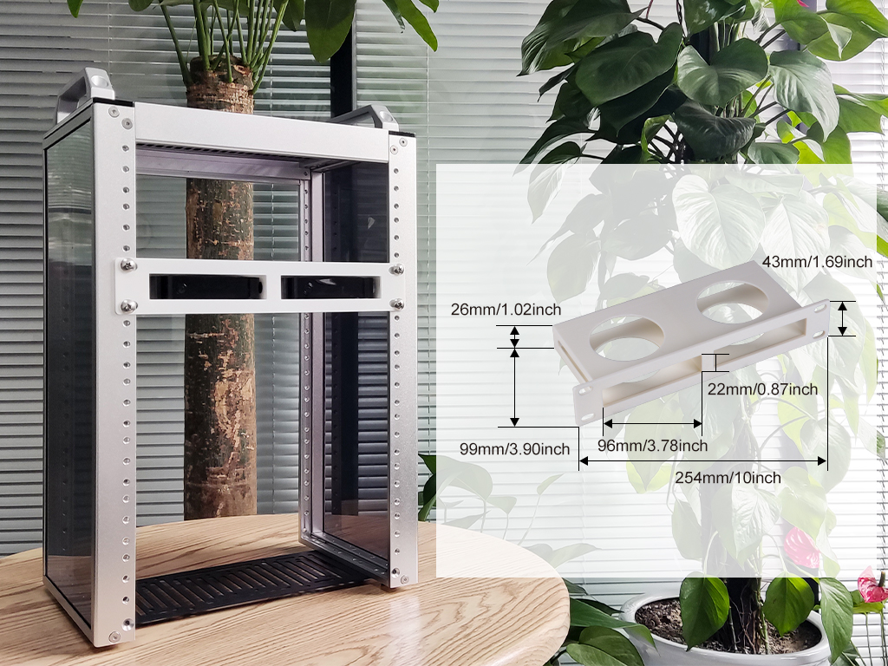
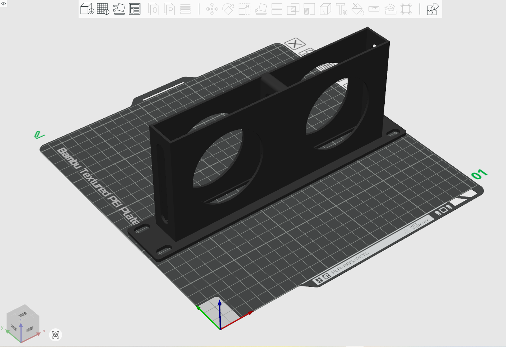
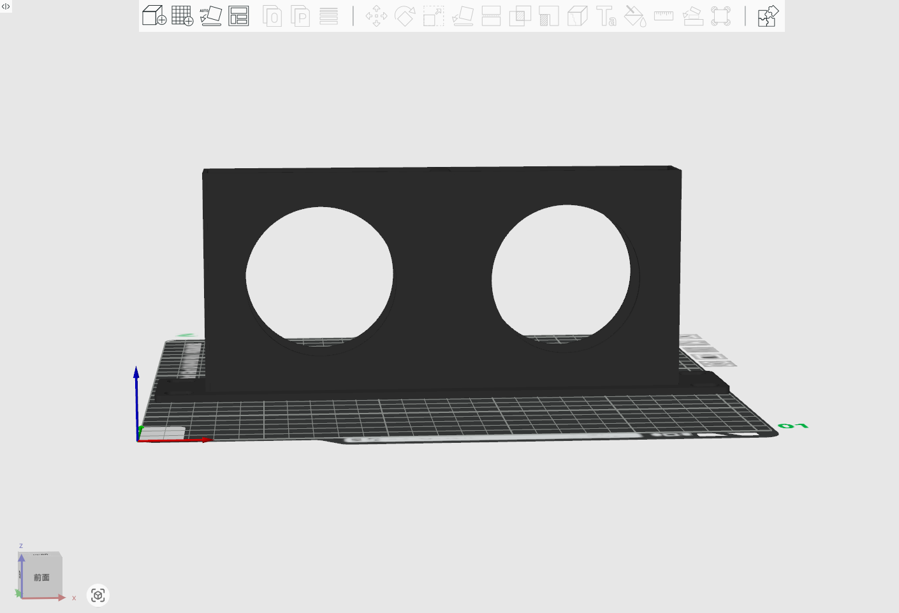
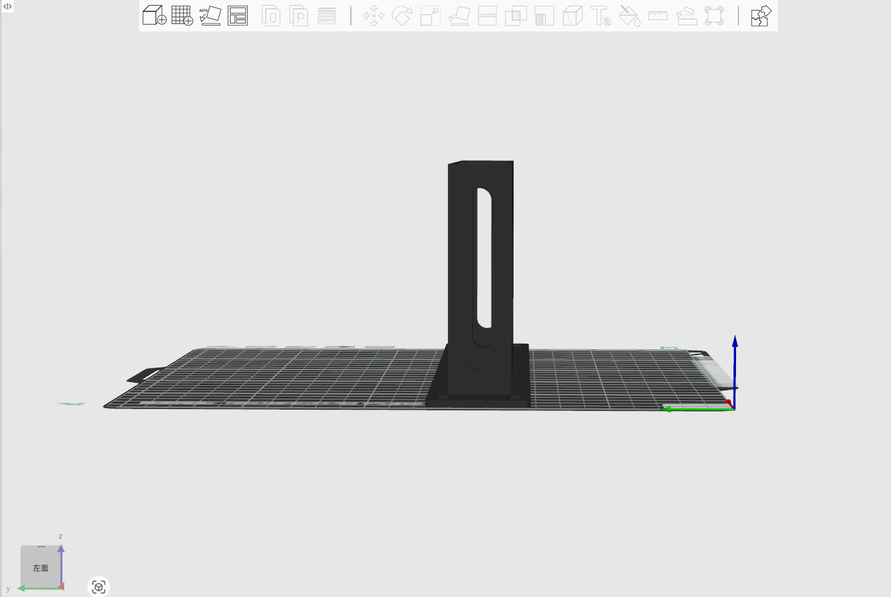
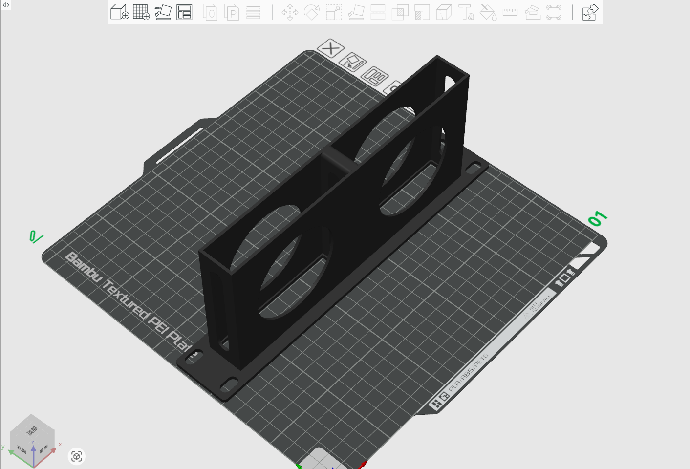
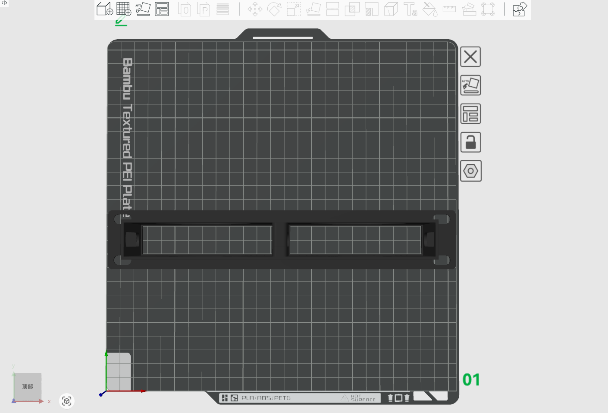

# 1U Tray for 2xHDDC mini PC

## Description 
This is 1U Tray for 2 x Heading Data Center Mini PC. 

* Model Type: 1U 
* Model Length: 10-inch
* Model Size: 254mm x 44mm x 3mm
* Model Fit for: DeskPi Rackmate T0/T1/T2 

## Gallery

## Model 

* [FreeCAD File](./models/2xHDDC_heading_data_center_rackmout_for_deskpi_rackmate_T0_T1_T2.FCStd)
* [3mf File](./models/2xHDDC_heading_data_center_rackmount_for_deskpi_rackmate_T0T1T2.3mf)
* [Stl File](./models/2xHDDC_heading_data_center_rackmout_for_deskpi_rackmate_T0_T1_T2-BodyMirrored004.stl)
* [Step File](./models/2xHDDC_heading_data_center_rackmout_for_deskpi_rackmate_T0_T1_T2-BodyMirrored004.step)
