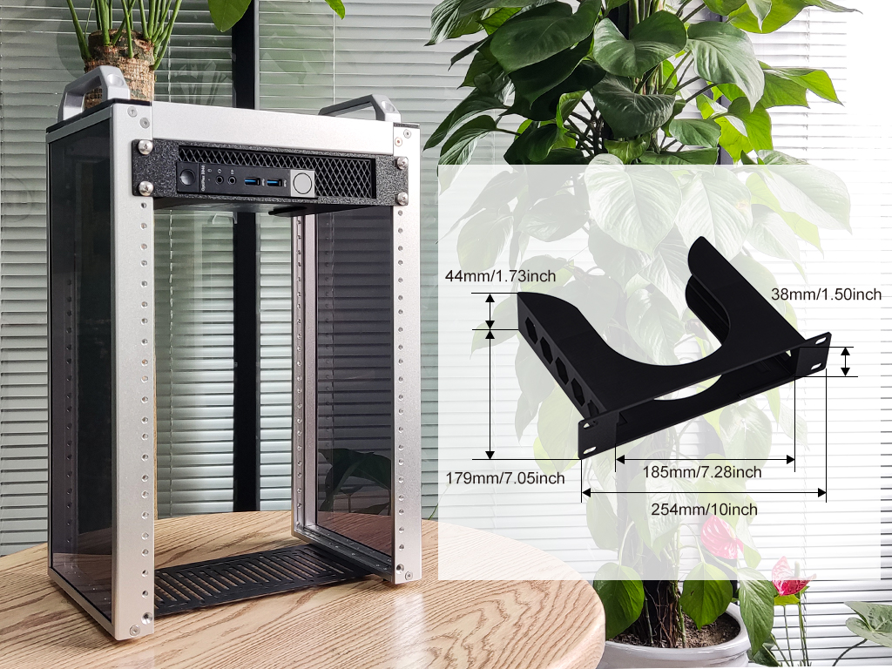
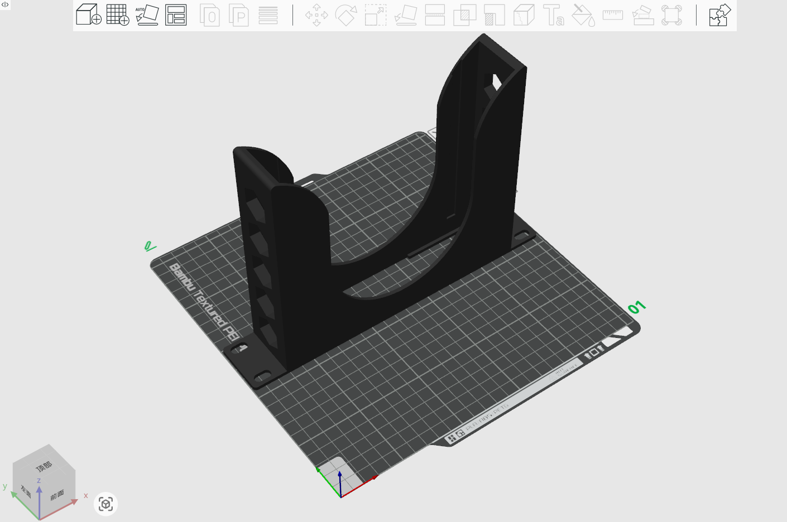
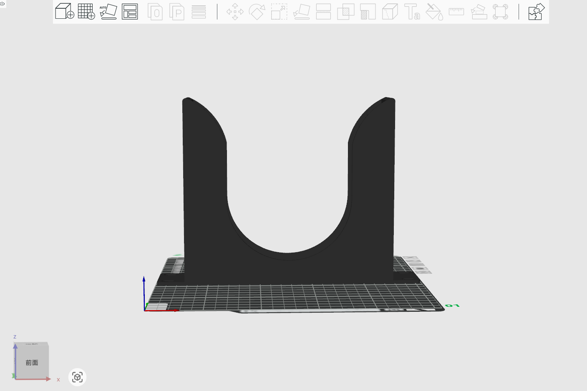
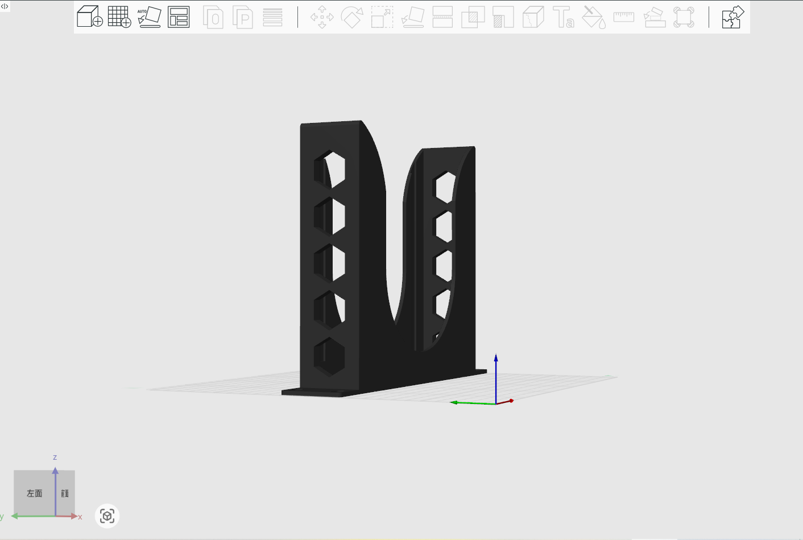
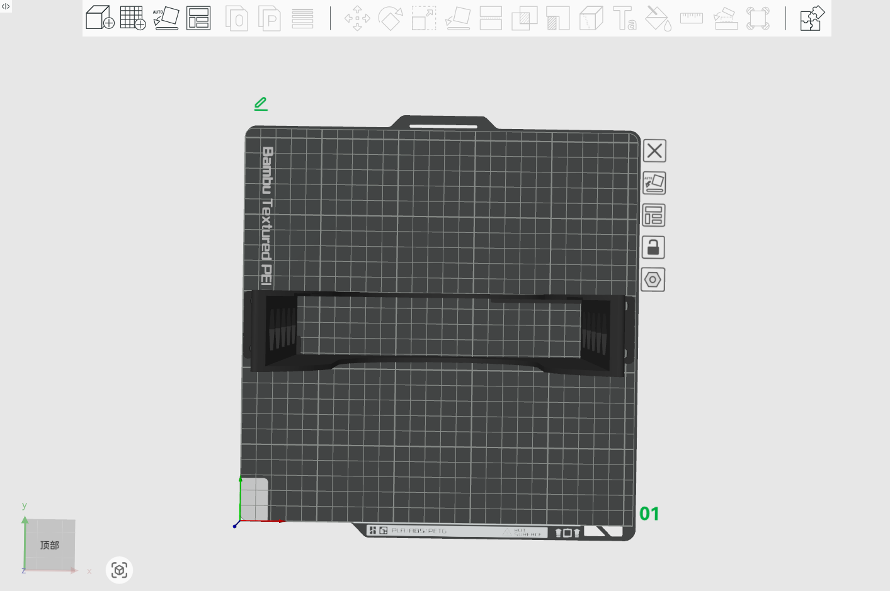
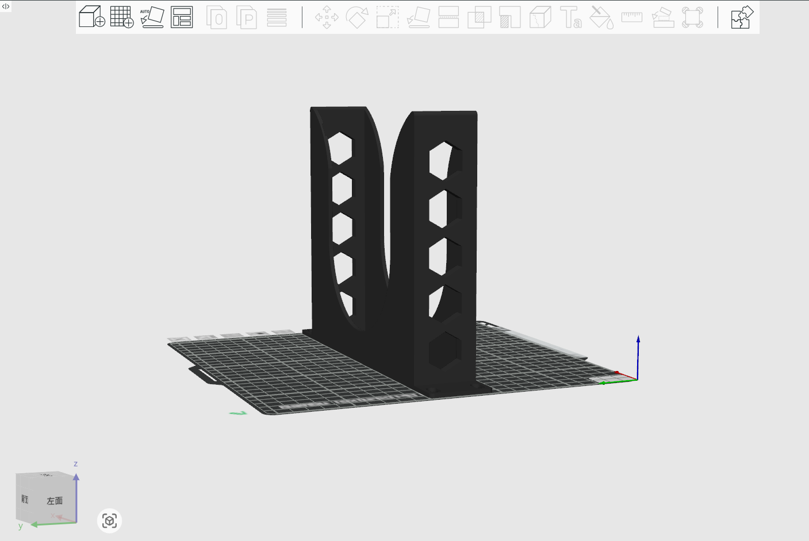

# 1U Rackmount for DELL Optiplex 3040 

## Description
This is 1U Rackmount for DELL Optiplex 3040 mini PC. 

* Model Type: 1U
* Model Length: 10-inch
* Model Size: 254mm x 44mm x 179mm 
* Mounting holes distance: 38mm 

## Gallery 

## Model

* [FreeCAD File](./models/Dell_OptiPlex_3040_rackmount_for_deskpi_rackmate_T0_T1_T2_10inch.FCStd)
* [3mf File](./models/Dell-Optiplex-7060_10-inch-rackmount.3mf)
* [Stl File](./models/Dell-Optiplex-7060_10-inch-rackmount.stl)
