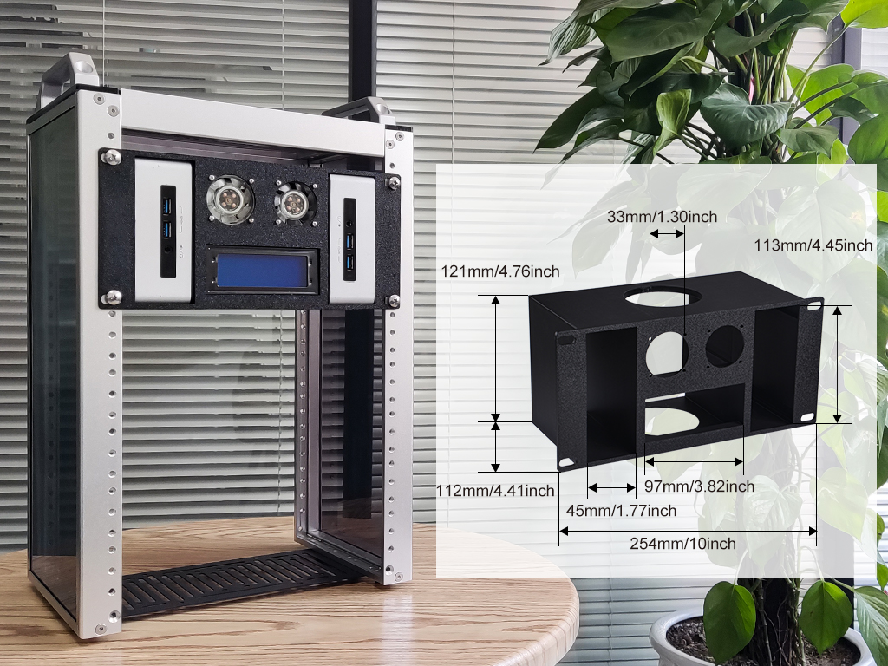
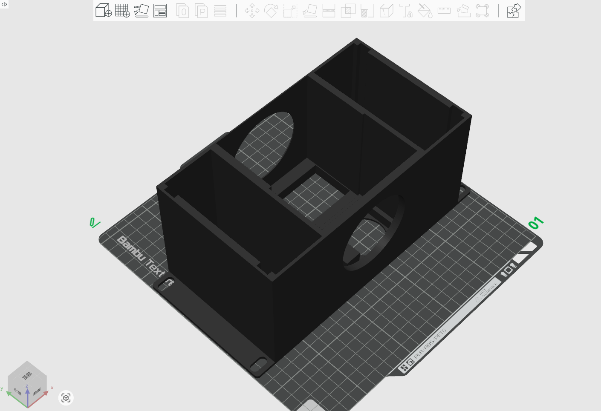
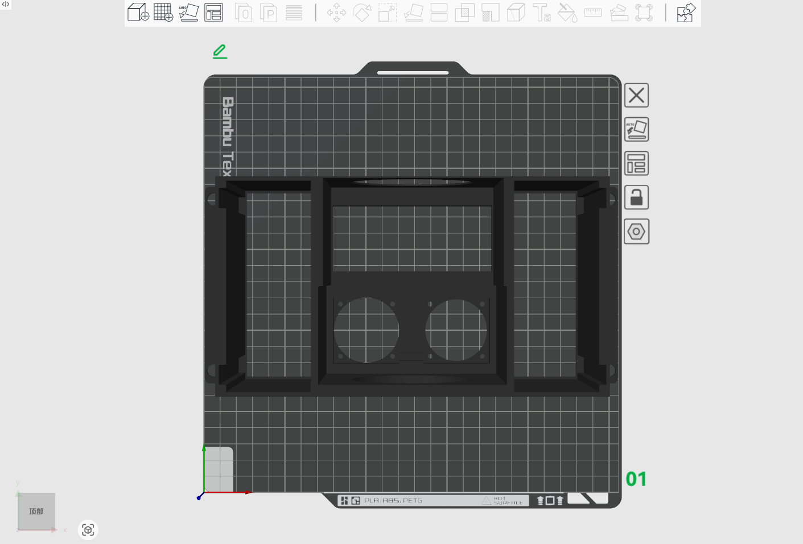
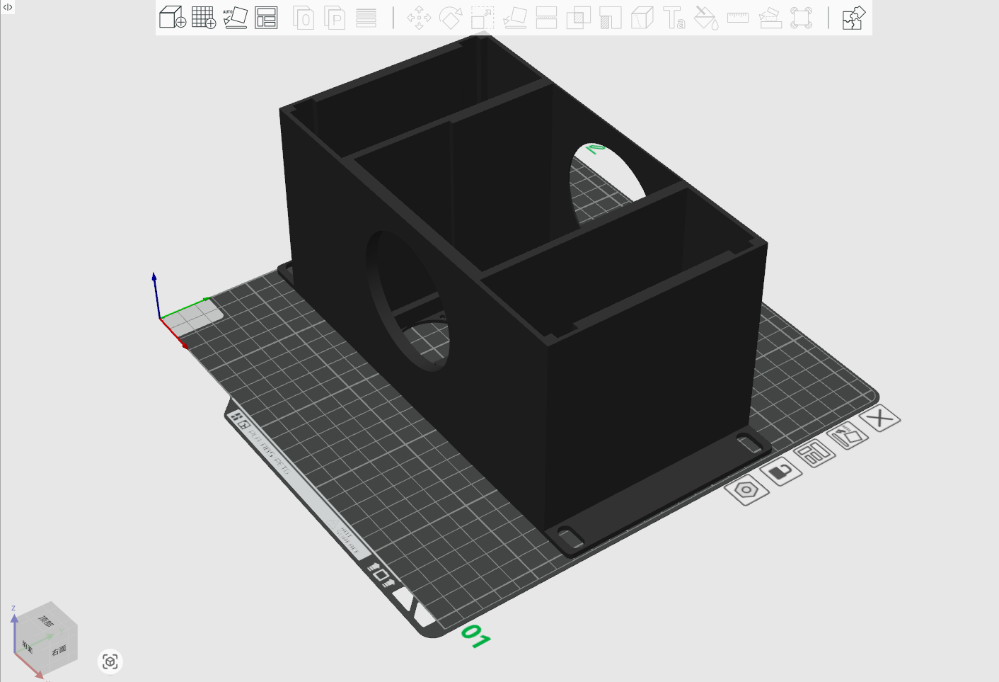
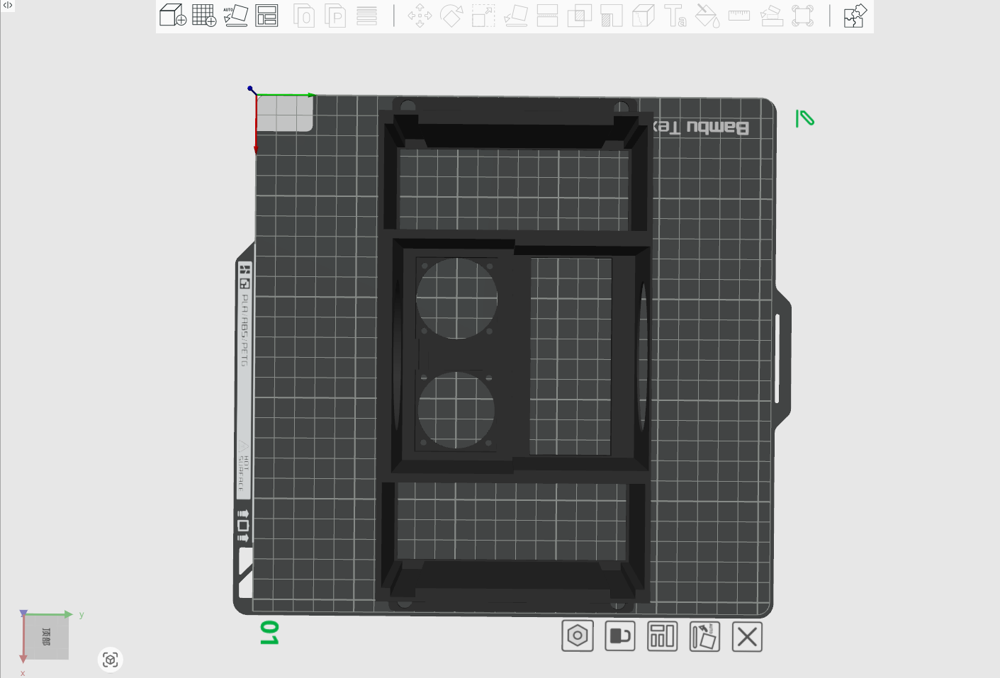

# 3U Rackmount with LCD2004 Display and Fans 

## Description 
This 3U Rackmount has one LCD2004 Display and 2 x Fan with it, it can hold two
of Intel NUC Mini PC with it. 

* Model Type: 3U
* Model Length: 10-inch 
* Model Size: 254mm x 121mm x 113mm
* Model Fit for: DeskPi Rackmate T0/T1/T2

## Gallery

## Model

* [FreeCAD File](./models/LCD2004_Fan_holder_DeskPi_Rackmate_3U_rackmount.FCStd)
* [3mf File](./models/LCD2004_holder_DeskPi_Rackmate_3U_rackmount.3mf)
* [Step File](./models/LCD2004_holder_DeskPi_Rackmate_3U_rackmount.step)
* [Stl File](./models/LCD2004_holder_DeskPi_Rackmate_3U_rackmount.stl)
* [Obj File](./models/LCD2004_holder_DeskPi_Rackmate_3U_rackmount.obj)
