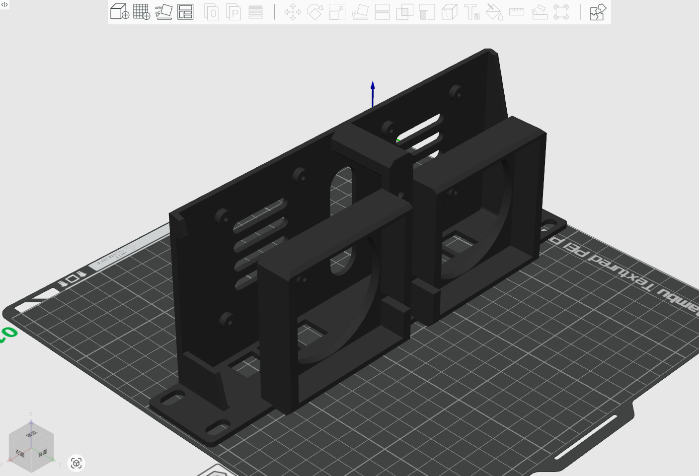
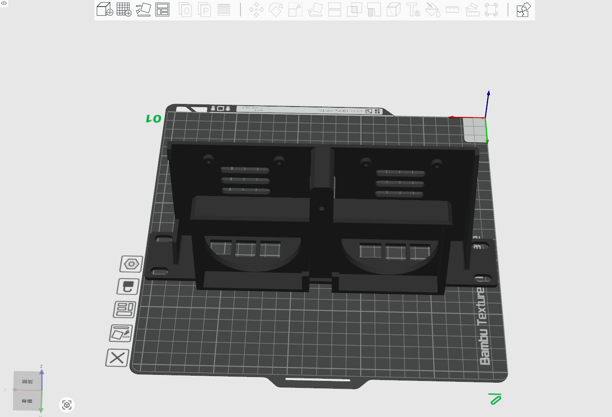
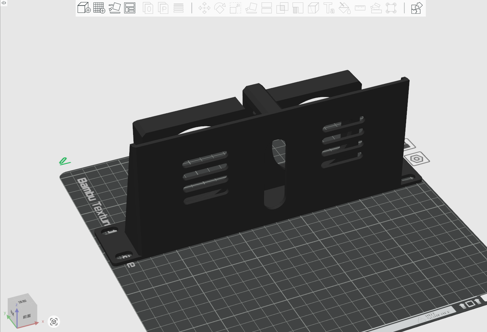
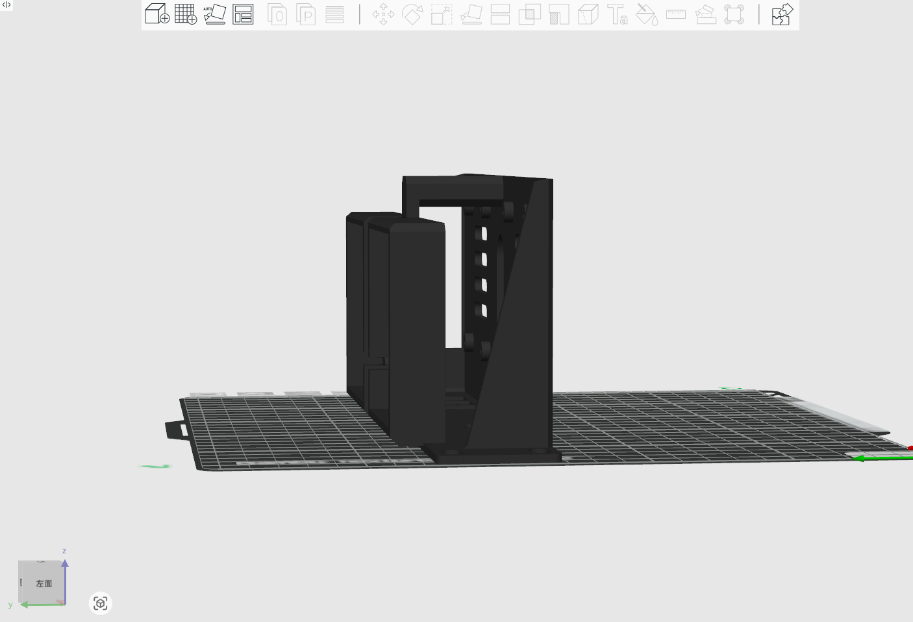
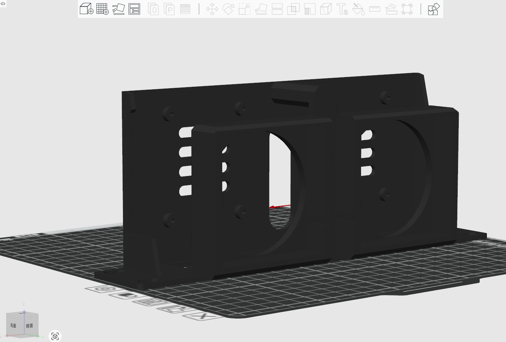
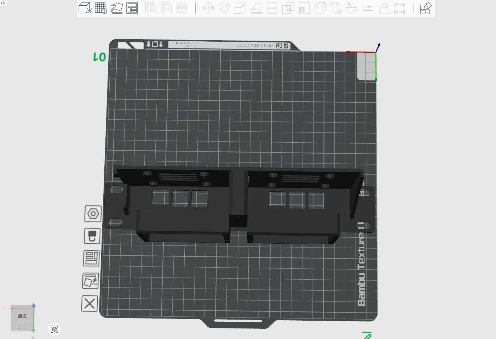

# Double fan with Double Raspberry Pi 5 Tray for DeskPi Rackmate T0/T1/T2

## Description 
This Tray is almost 2U rackmount for 2 Raspberry Pi 5 with 2 Fans for heat
dissipationing. 

* Model Type: 2U  (almost)
* Model Length: 10-inch
* Model Size: TBD.
* Model Fit for: DeskPi Rackmate T0/T1/T2

## Gallery

## Model 

* [FreeCAD File](./models/RaspberryPi_holder_for_DeskPi_rackmate_T_series.FCStd)
* [3mf File](./models/RaspberryPi_holder_for_DeskPi_rackmate_T_series.3mf)
