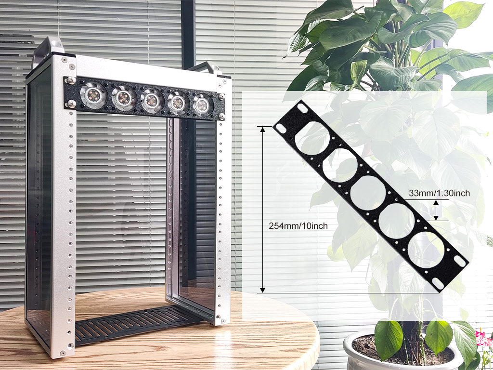
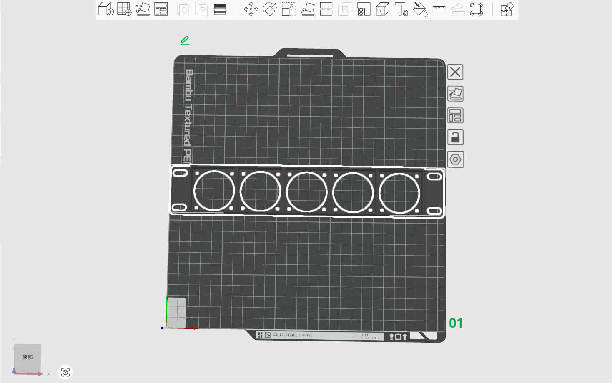
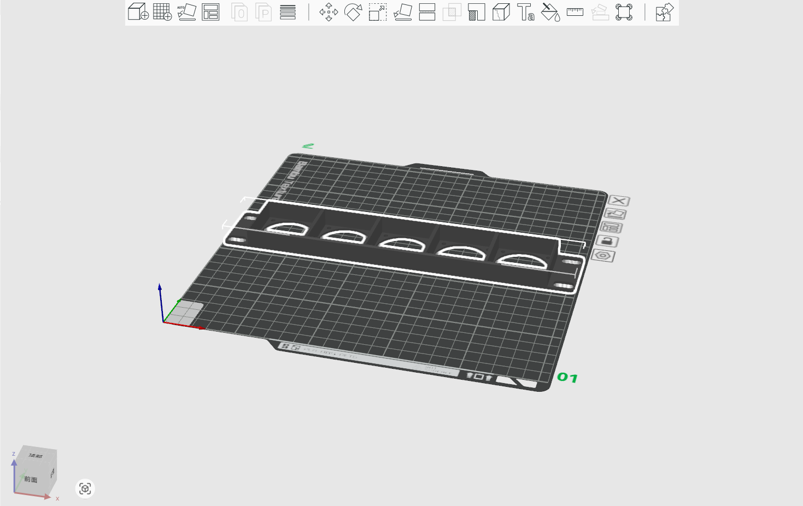

# Multiple Fans rack mount for DeskPi rackmate T1/T2 

## Description

This is a 1U rackmount for your DeskPi rackmate T1 or T2, it will hold 6 PCs 4010 Fan. 
* Model Type: 1U
* Model Length: 10-inch
* Model Size: 254mm x 44mm x 3mm
* Fan size :  40 x 40 x 10 mm
* Screw hole size:  M2.5 (2.5mm) 

## Gallery 

## Models

* [FreeCAD source file](./models/DeskPi_Rackmate_Fan_blade.FCStd)
* [3D print .3mf file ](./models/DeskPi_Rackmate_Fan_blade.3mf)
