# DeskPi RackMate TT: Side Ecosystem for Tools

## Description 
While retaining the strength of its metal frame and the convenience of dual handles, this design introduces a full 3D-printed side-mount ecosystem—drawers, baskets, and hooks that can be added as needed—so tools, adapters, SSD enclosures, and cables each have a dedicated place.

## Compatiblity 

* Compatible with DeskPi RackMate TT

## Gallery 

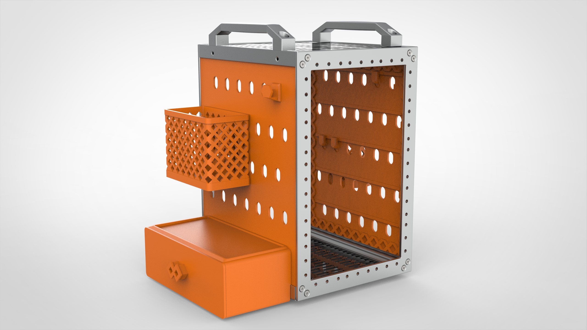
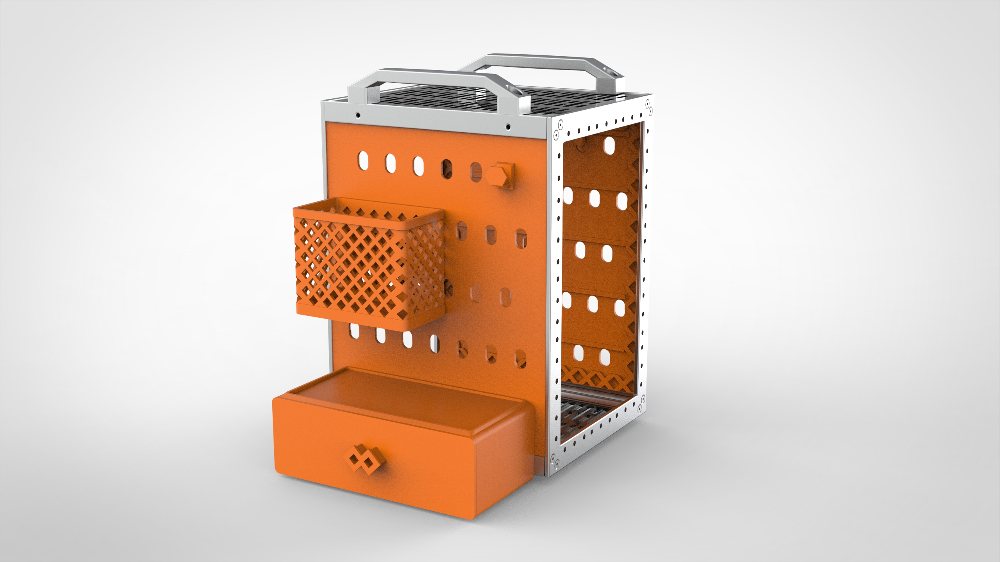
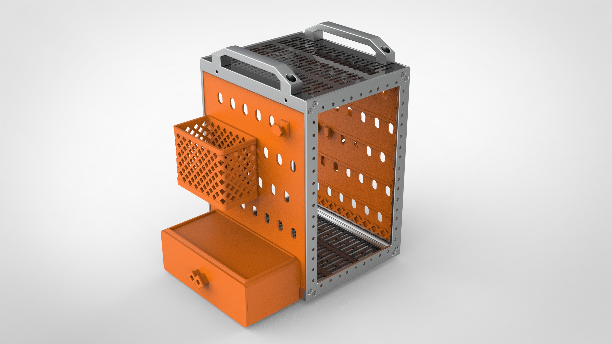
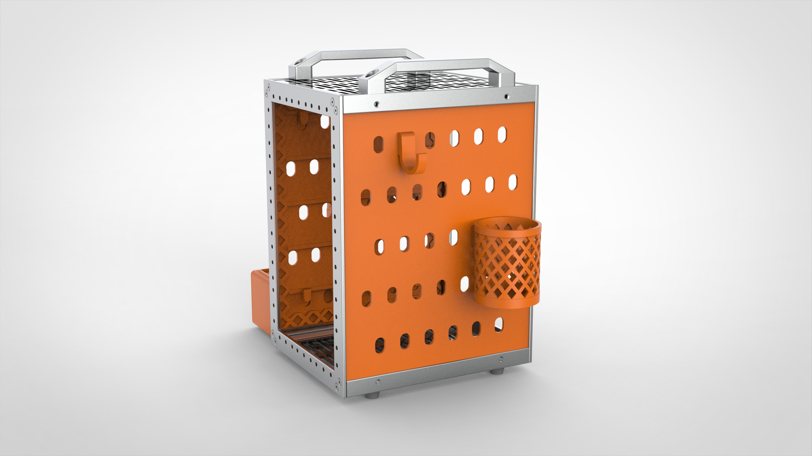
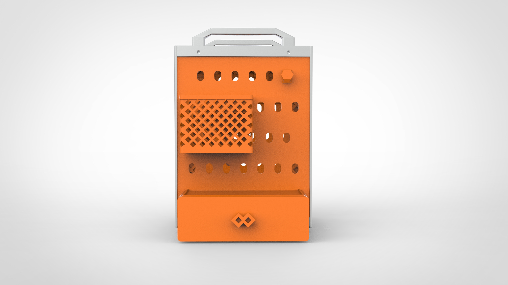
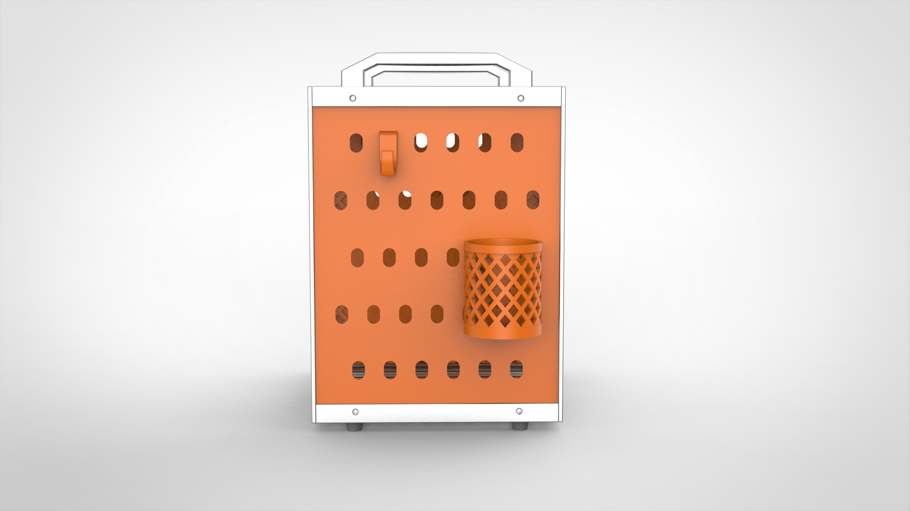
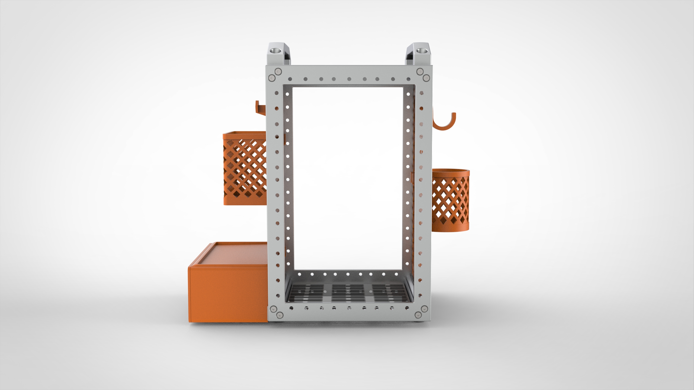
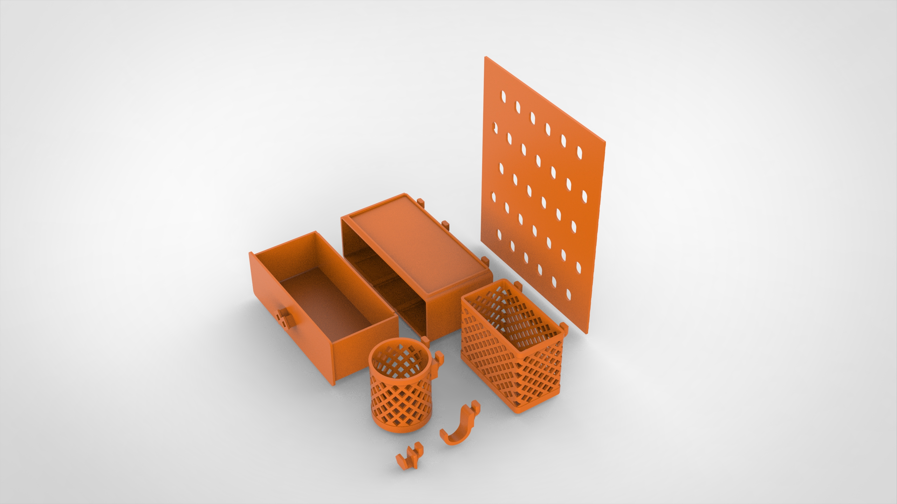
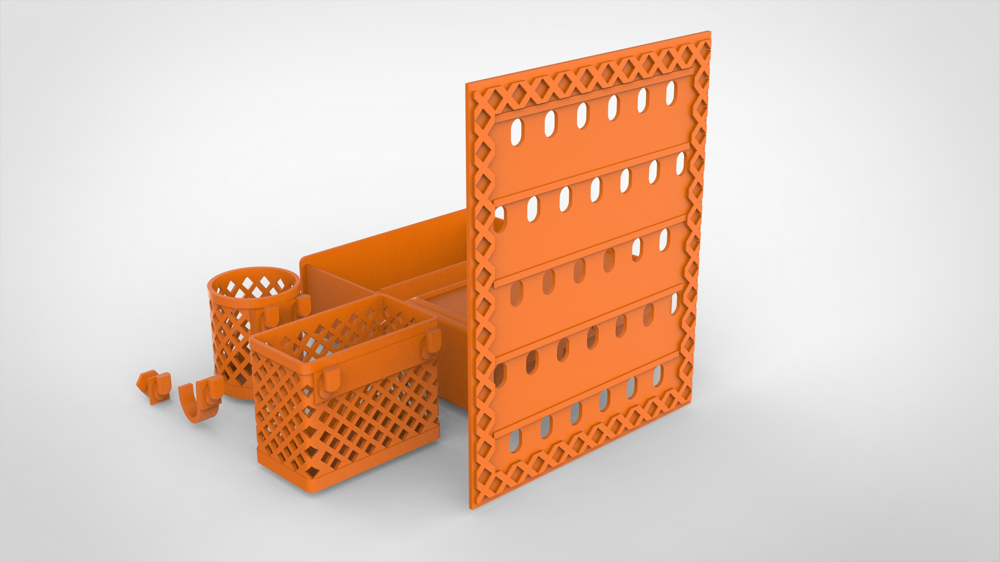
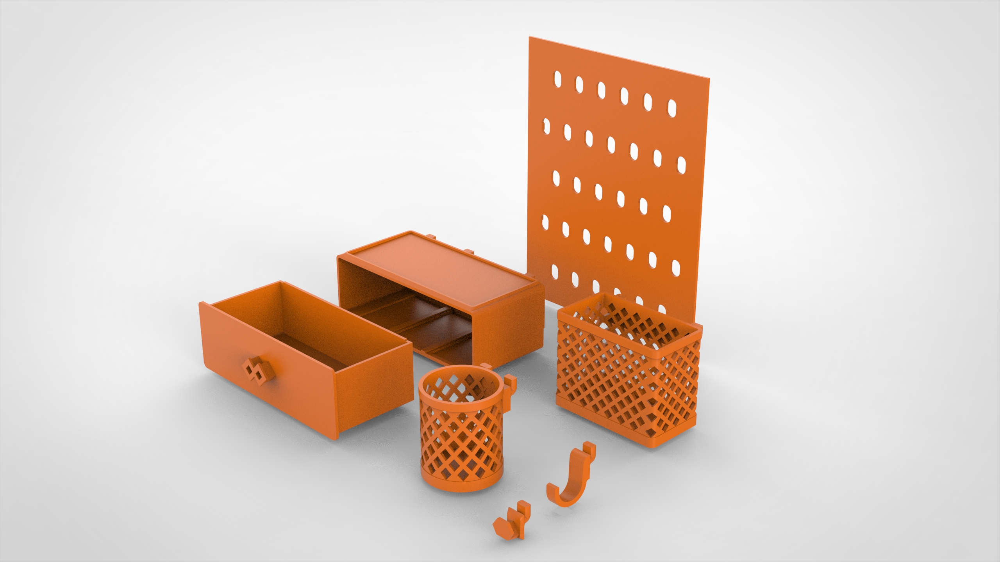
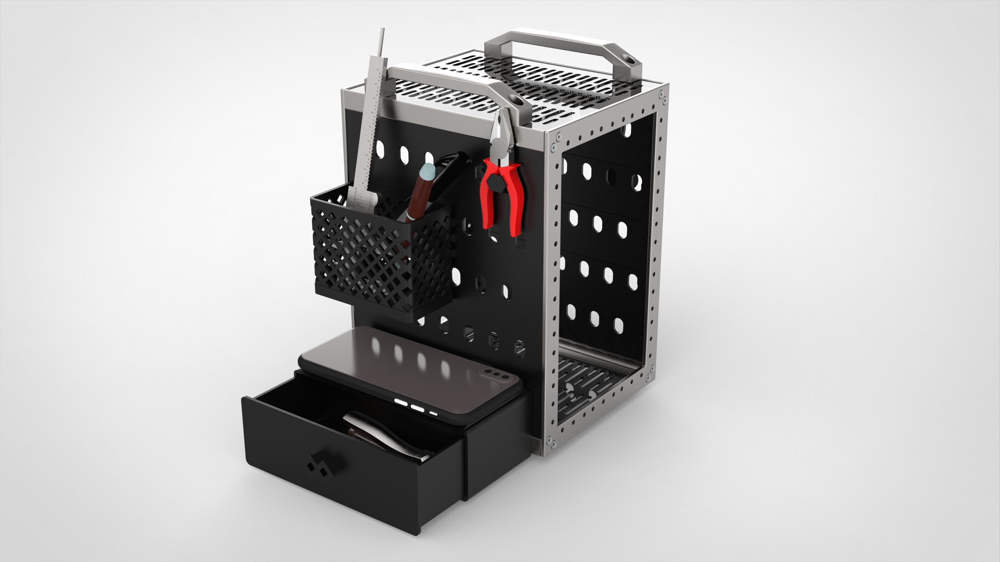
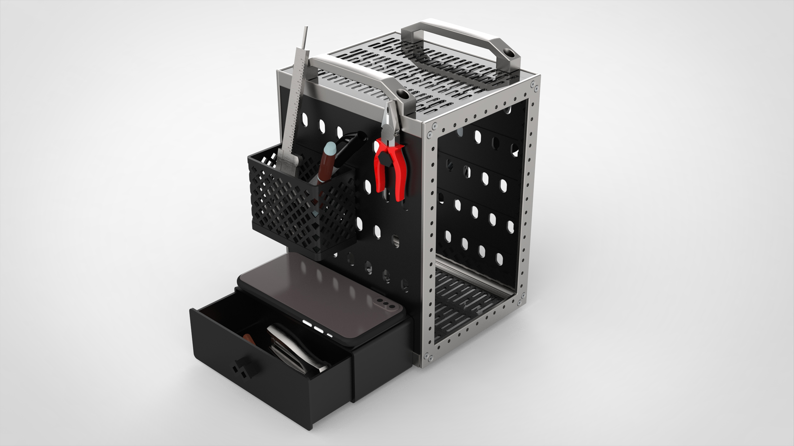
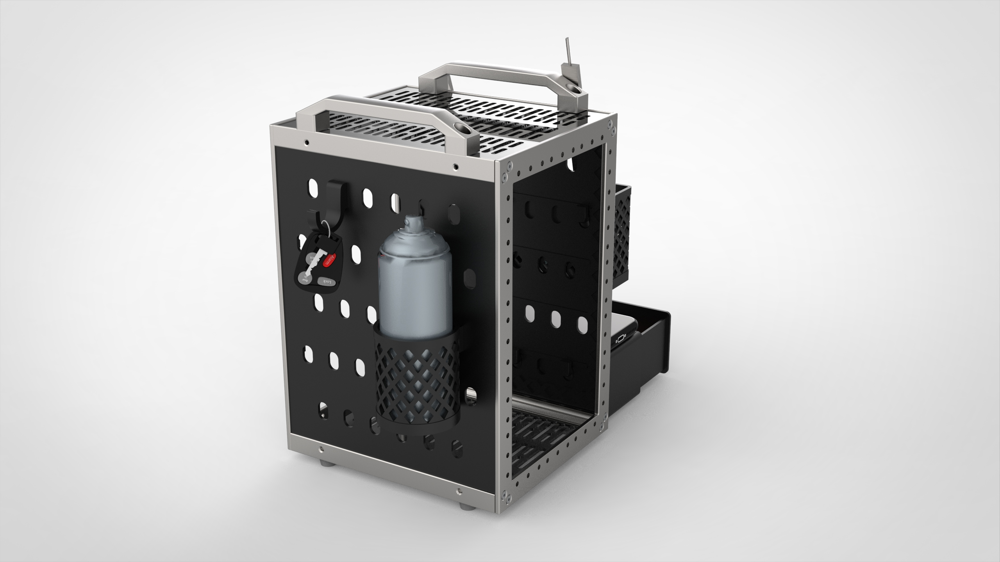
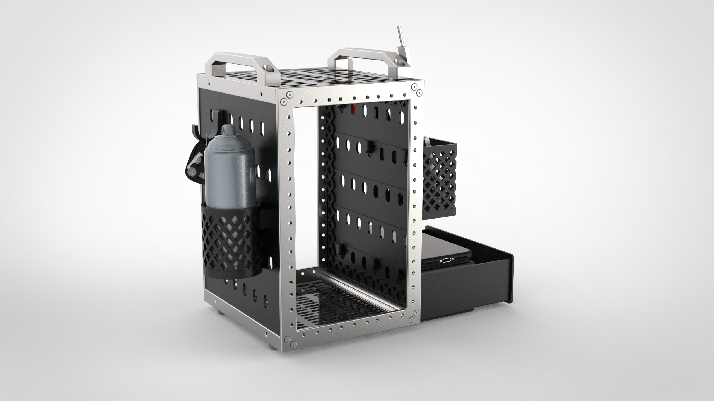
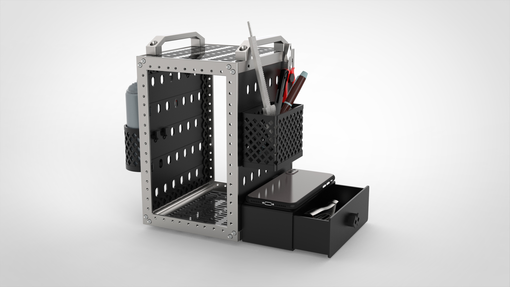
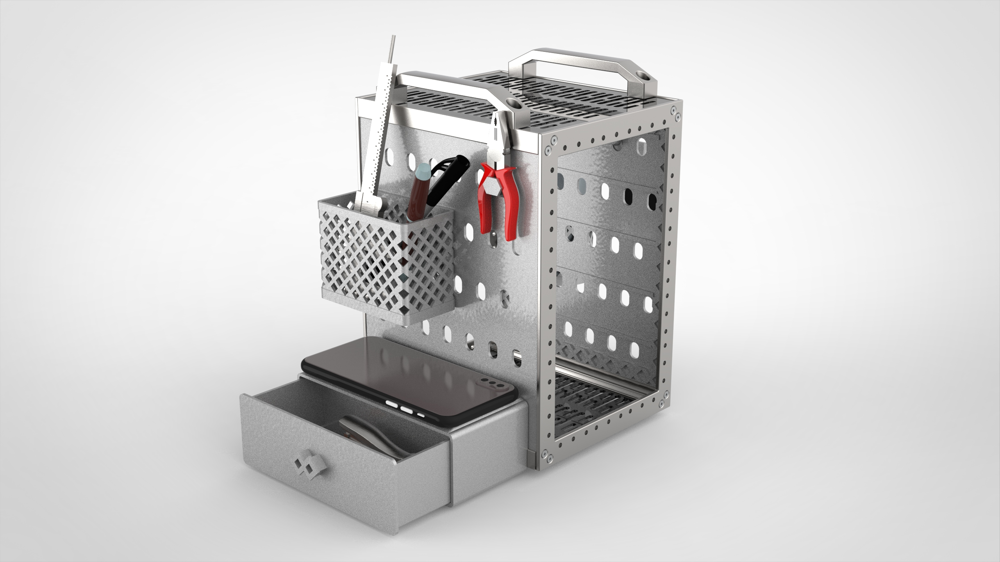
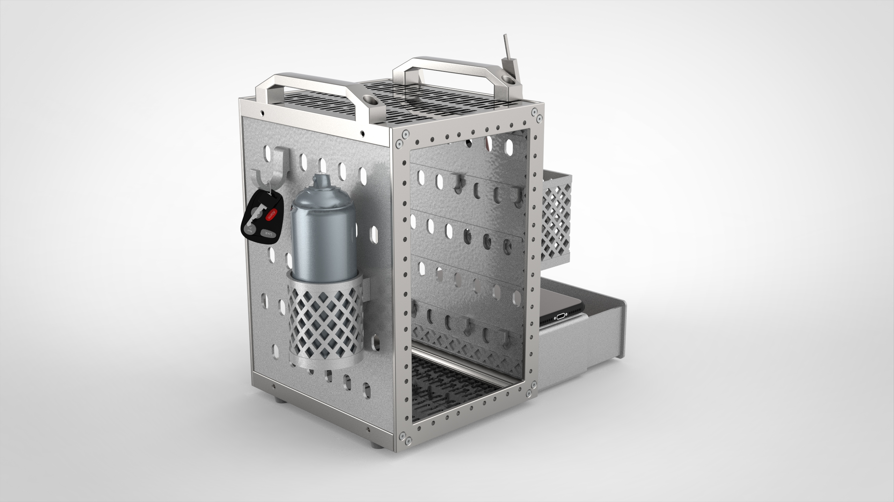

## Visit print.deskpi.com 
* [print.deskpi.com](https://print.deskpi.com)
