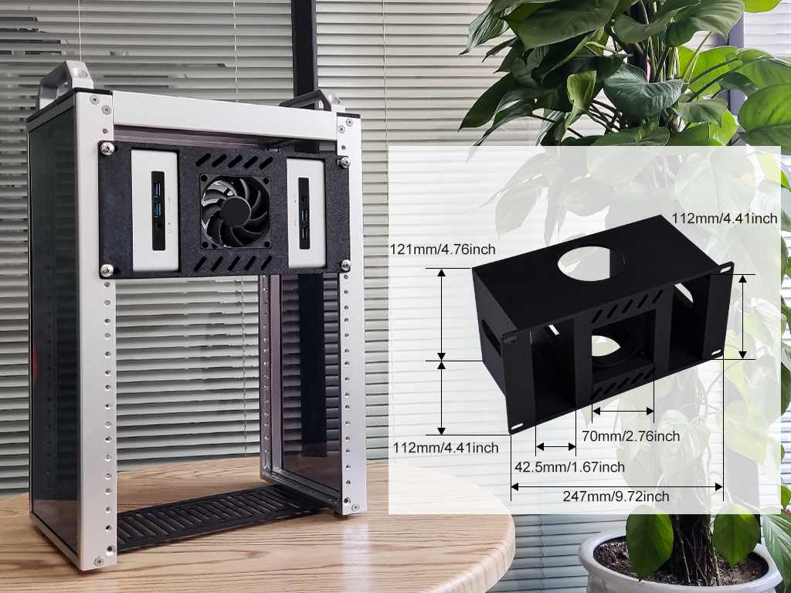
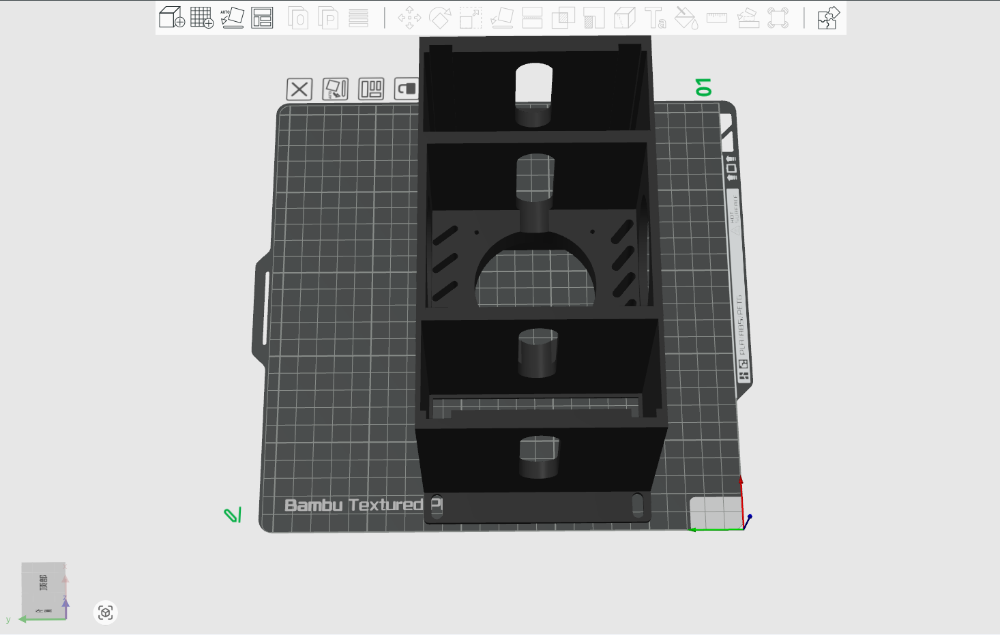
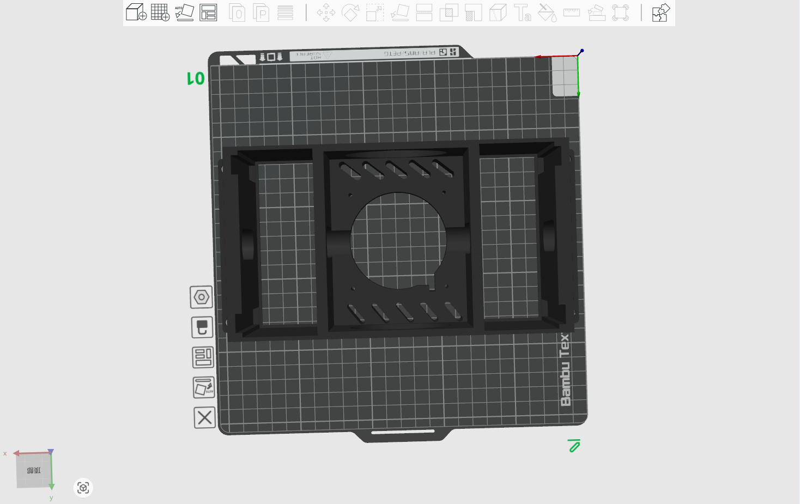

# 2 x Intel NUC mini PCwith Fan rackmount for DeskPi rackmate T1/T2 

## Description

This is a 3U rackmount for your DeskPi rackmate T1 or T2, it will hold 2 pcs Intel NUC mini PC and a Fan with it in the center of the rackmount. 
*  Fan size :  70 x 70 x 15 mm
*  Screw hole size:  M4 (4.6mm) 

## Gallery 

## Models

* [FreeCAD File](./models/2xMiniPC_holder_on_DeskPi_rackmate_T_series.FCStd)
* [3D Print File V1](./models/2xMiniPC_holder_on_DeskPi_rackmate_T_series_v1.3mf)
* [3D Print File V2](./models/2xMiniPC_holder_on_DeskPi_rackmate_T_series_v2.3mf)
* [3D Print File V3](./models/2xMiniPC_holder_on_DeskPi_rackmate_T_series_v3.3mf)

