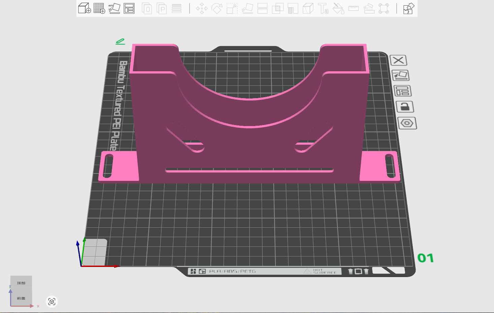
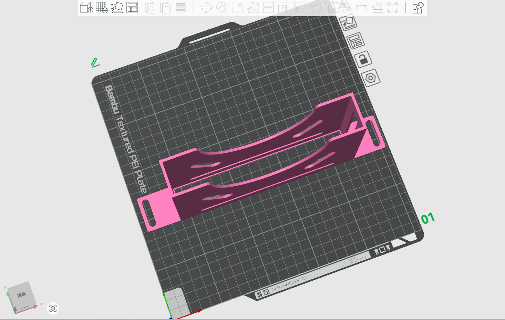
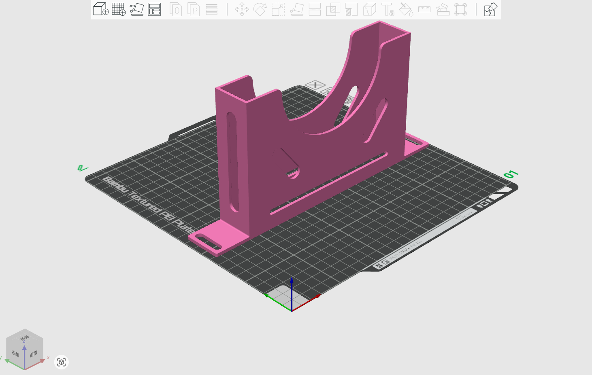
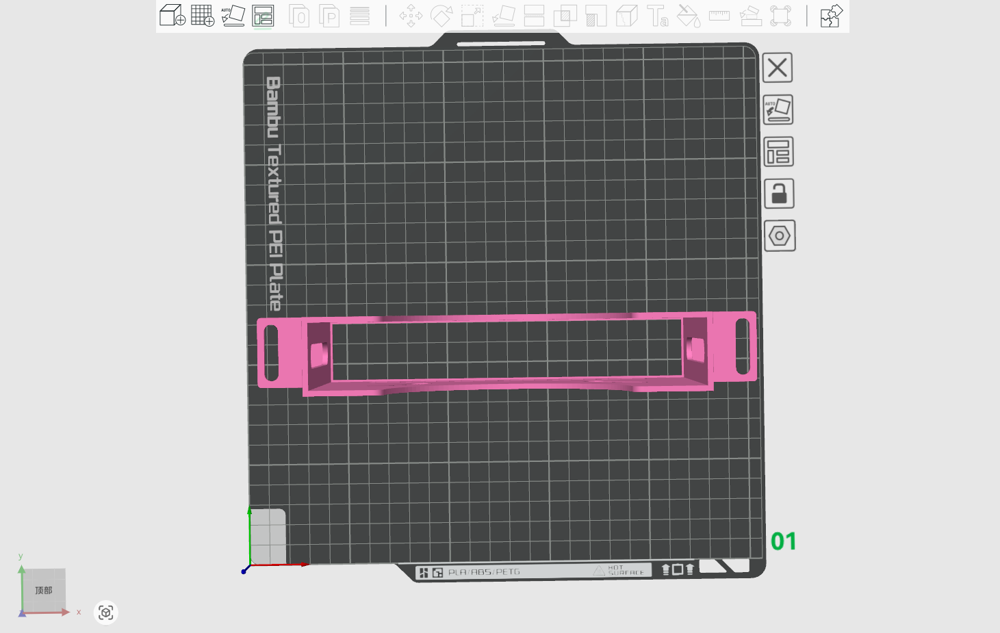
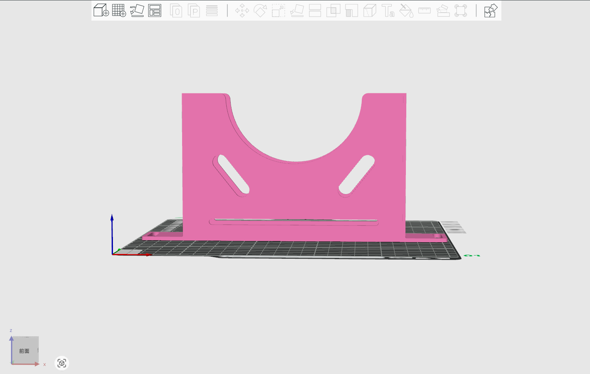

# KVM switch Rackmount for DeskPi Rackmate T1

## Description

This is a 0.5 U rackmount for your DeskPi rackmate T1 or T2 
* KVM size : width 175 mm, Height: 28mm
  
## Gallery

## Models

* [FreeCAD File](./models/KVM_Switch_w17.5_h2.8_slot.FCStd)
* [3D Print File](./models/KVM_Switch_w17.5_h2.8_slot.3mf)

