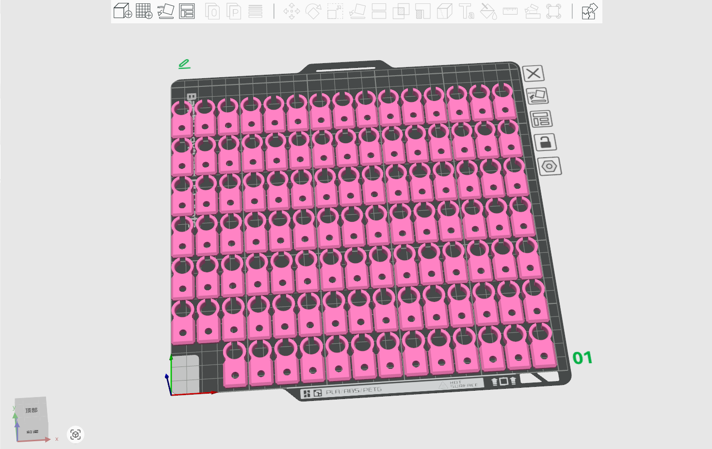
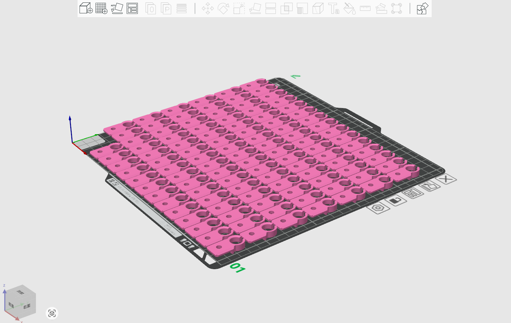
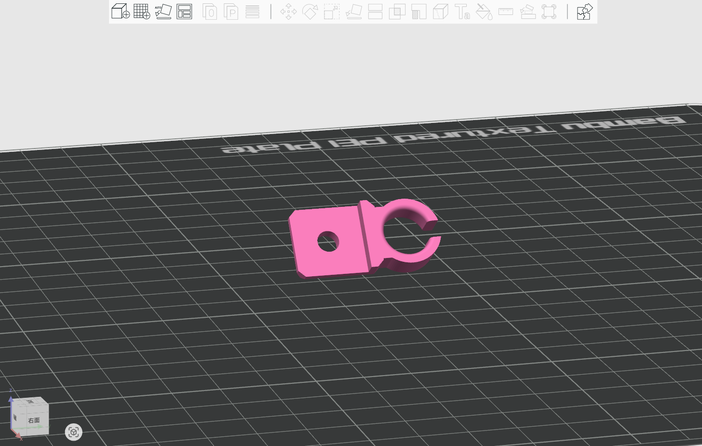

# Cable holder for DeskPi rackmate T1/T2 

## Description 

This is small cable holder for your DeskPi rackmate T1 or T2, it can be mount to your Rackmate in any position. 

* Fit for DeskPi Rackmate TT/T0/T1/T2
   
## Gallery

## Models

* [FreeCAD File](./models/Rackmate_Cable_holder.FCStd)
* [3D Print File](./models/Rackmate_Cable_holder.3mf)

