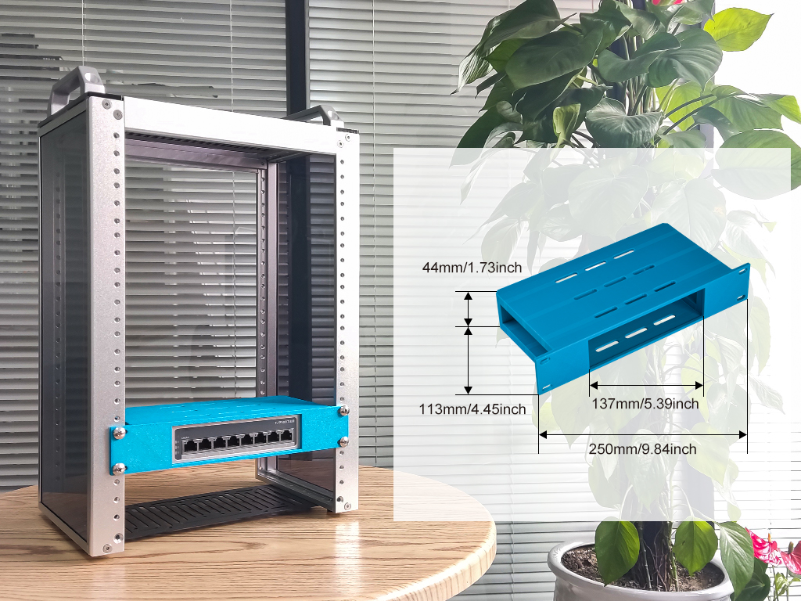
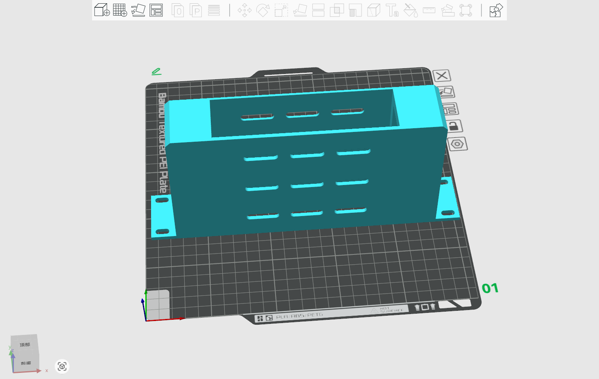
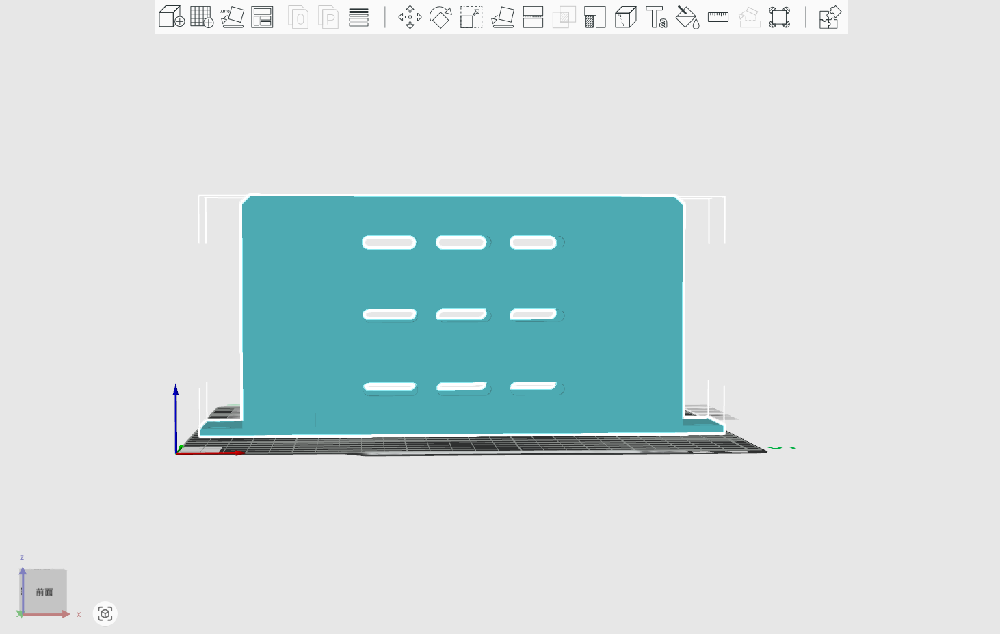
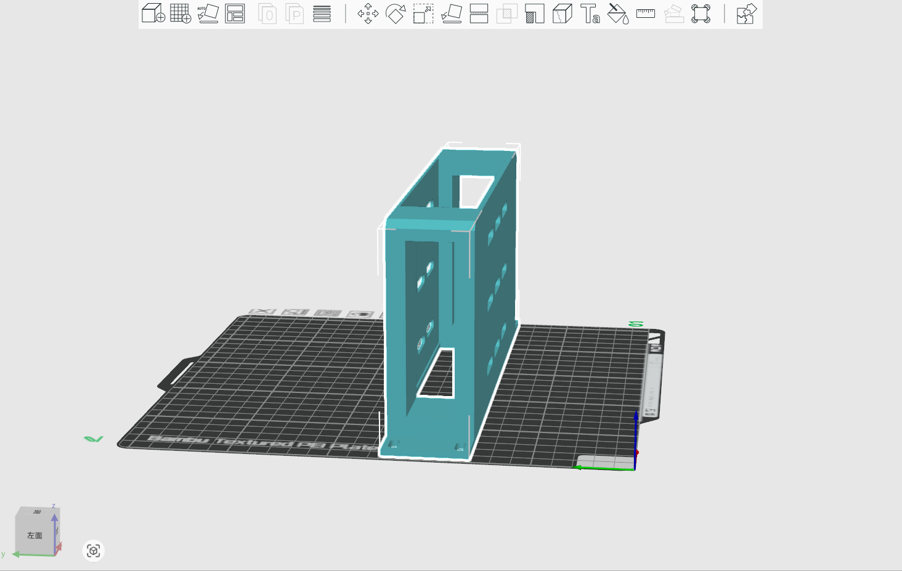
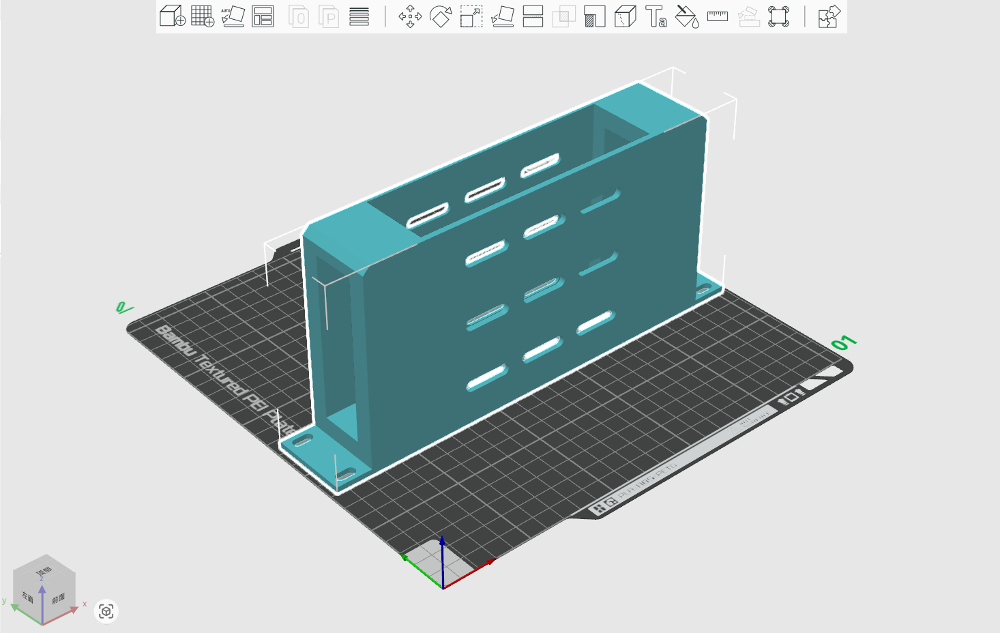

# 1U-TP-LINK-TL-SF1008-Switch rack mount  for DeskPi rackmate T1/T2 

## Description
This is a 1U rackmount for DeskPi rackmate T1 or T2, it fit for 10-inch 1U TP-LINK-TL-SF1008 Switch 

* Model size :  250 x 44 x 113.5 mm
* Model Type: 1U (10-inch) 
* Model fit for : TP-LINK-TL-SF1008 Switch
 
## Gallery 

## Model 

* [FreeCAD File](./models/10inch-1U-TP-LINK-TL-SF1008-Switch-Plate_For_DeskPi_RackMate_Series.FCStd)
* [3D Print File](./models/10inch-1U-TP-LINK-TL-SF1008-Switch-Plate_For_DeskPi_RackMate_Series-latest.3mf)
