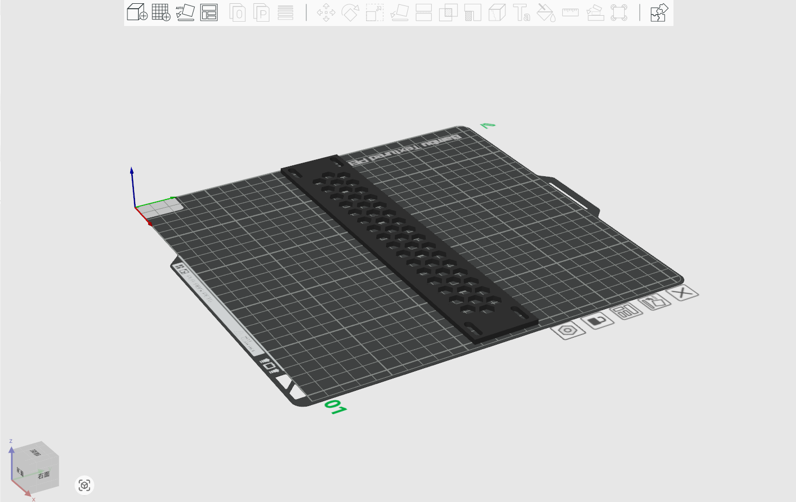

# 1U Blank panel  for DeskPi rackmate T1/T2 

## Description 

This is a 1U rackmount for your DeskPi rackmate T1 or T2 
   
* Model Size: 250 x 44 x 3.5 mm 
* Model Type: 1U 
* Model Length: 10-inch

## Gallery 

## Model

* [FreeCAD File](./models/Blank_Panel_for_DeskPi_rackmate_T0T1T2_1U_10inch.FCStd)
* [3D Print File](./models/Blank_Panel_for_DeskPi_rackmate_T0T1T2.3mf)_
* [Mechanical Drawing File](./imgs/Blank_Panel_for_DeskPi_rackmate_T0T1T2.pdf)
