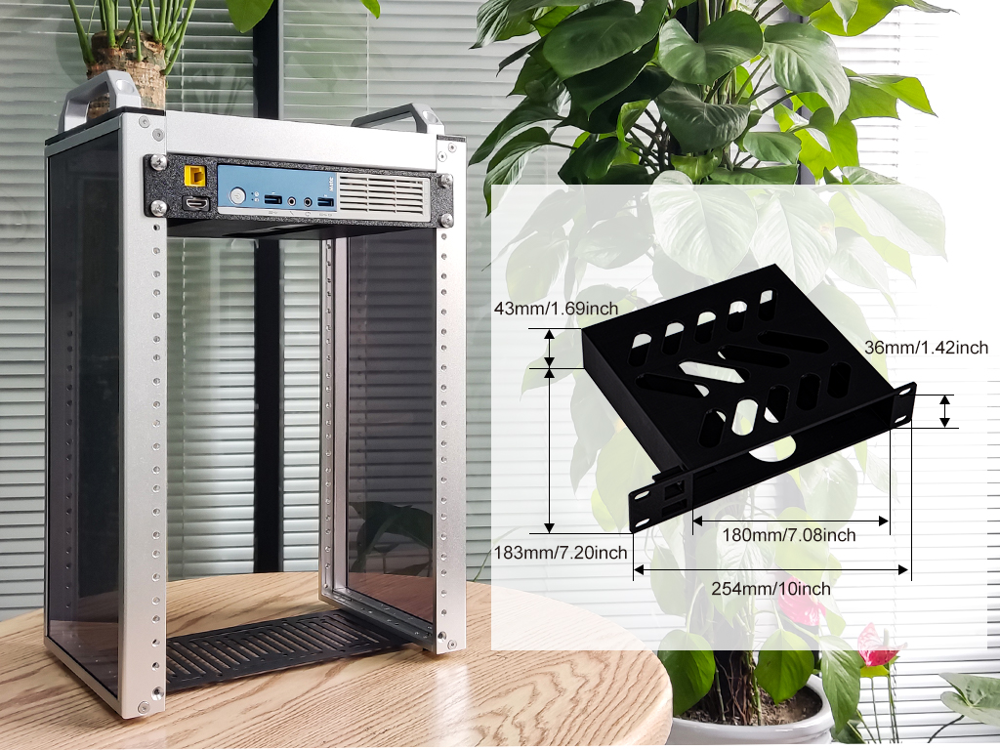
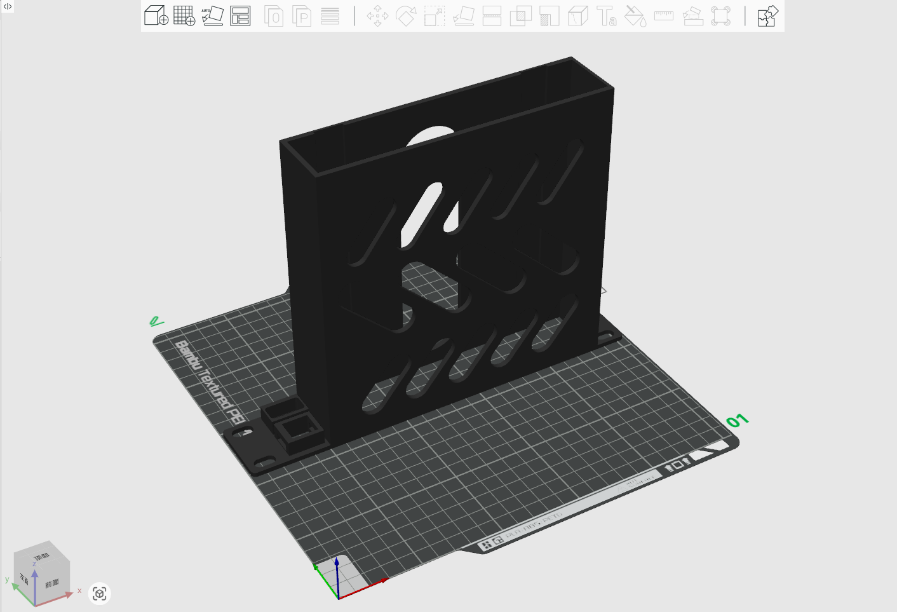
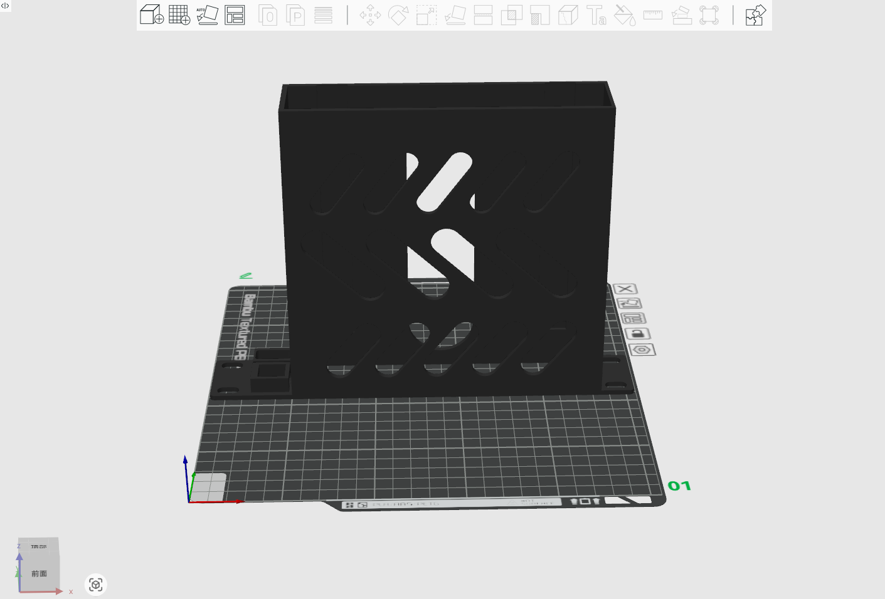
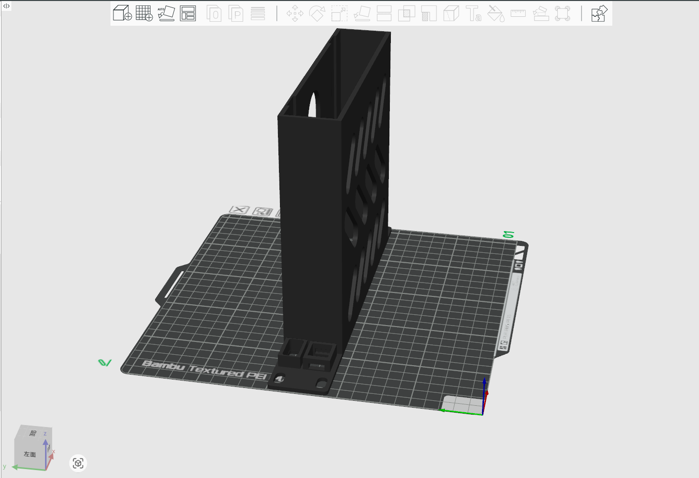
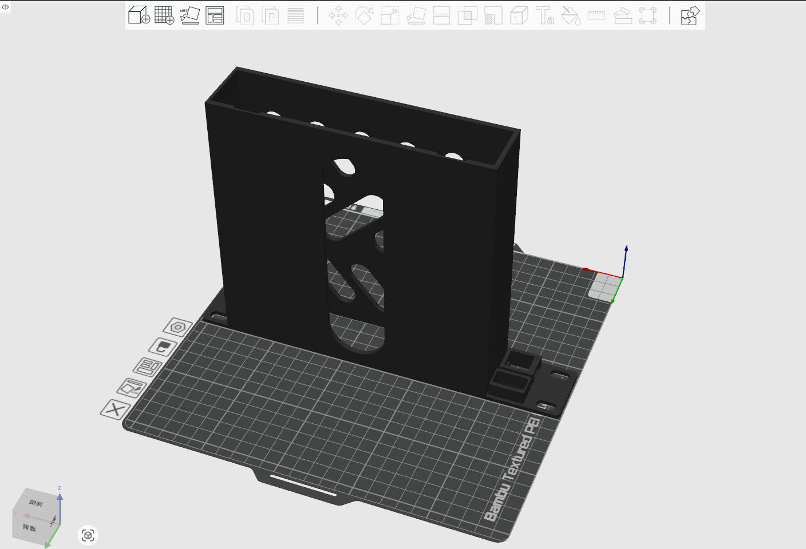
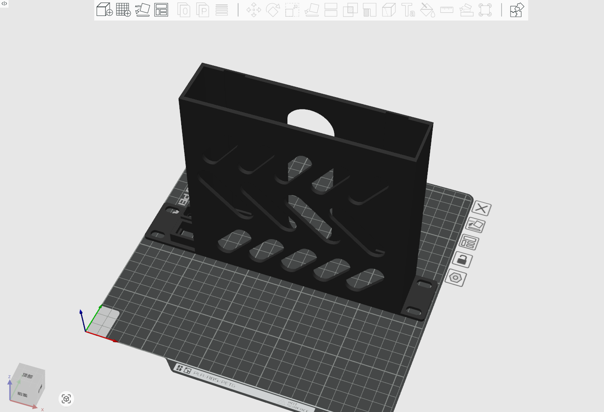

# NEC PC MJ25MCZGT Rackmount

## Description 
This is 1U 10-inch Rackmount for NEC PC Version MJ25MCZGT. 

* Model size: 254mm * 44mm * 3mm 
* Model Type: 1U 
* Model Length: 10-inch 
* Model Fit for: DeskPi Rackmate T0/T1/T2 

## Gallery

## Model 

* [FreeCAD File](./models/Rackmount_for_NEC_PC_MK32VCZGT.FCStd)
* [Step File](./models/Rackmount_for_NEC_PC_MK32VCZGT-BodyPocket014.step)
* [3mf File](./models/Rackmount_for_NEC_PC_MK32VCZGT-Bod14.3mf)
* [Stl File](./models/Rackmount_for_NEC_PC_MK32VCZGT-BodyPocket014.stl)
