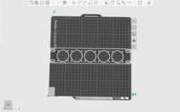

# 3DPrint-Models
3D models for DeskPi Rackmate T series

## Download Chart 

| Thumbnails | 3D model Download URL|
| ----------- | ----------- |
|  |[3mf file](./3D_print_models/Model_1_Multiple_Fans_Rackmount/models/DeskPi_Rackmate_Fan_blade.3mf)       |
|  |[3mf file](./3D_print_models/Model_1_Multiple_Fans_Rackmount/models/DeskPi_Rackmate_Fan_blade.3mf)       |

## Architecture 
<pre>
3D_print_models
├── convert.sh
├── Model_10_Acer_Veriton_C655_Rackmount
├── Model_11_Mac_Mini_holder
├── Model_12_2xHDDC_Heading_Data_Center_Rackmount
├── Model_13_DELL_Optiplex_3040_Rackmount
├── Model_14_LCD2004_With_Fan_holder
├── Model_15_4xHD_Cluster_Rackmount
├── Model_16_DeskPi_Pro_Shelf
├── Model_17_2xRPi5_tray
├── Model_18_HP_MP9_1U_10_Inch_Rackmount
├── Model_19_7_Inch_Portable_Capacitive_touch_screen_case
├── Model_1_Multiple_Fans_Rackmount
├── Model_2_2xIntel_NUC_Mini_PC_with_Fan_rackmount
├── Model_3_KVM_Switch_Rackmount
├── Model_4_Cable_holder
├── Model_5_SW1010_10Ports_Switch_RackMount
├── Model_6_1U_TP_LINK_TL_SF1008_Switch_Rackmount
├── Model_7_1U_Blank_Panel
├── Model_8_7-Inch_52Pi_Portable_Touch_Screen_Rackmount
└── Model_9_NEC_PC_MJ25MCZGT_Rackmount
</pre>

